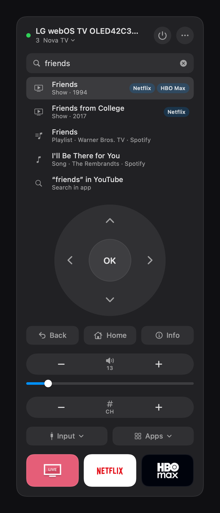
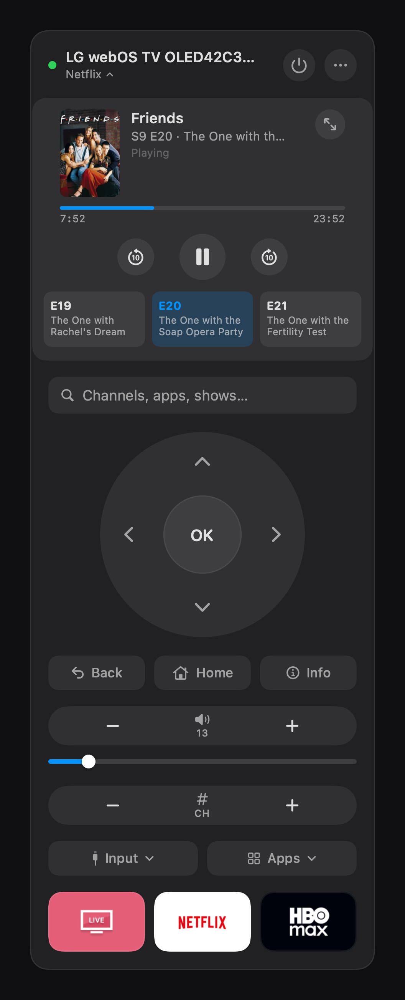

# Zapper

macOS menu bar remote for LG webOS TVs. Finds the TV over Bonjour, drives it
over SSAP — no HomeKit, no LG account.

<p align="center">
  
  
</p>

## Features

- **Search everything from one bar** (auto-focused — just start typing):
  - `123` → tunes to channel 123; channel names work too
  - `net` → suggests Netflix and other apps/inputs
  - `friends` → shows which of your streaming apps have it (Netflix *and*
    HBO Max, say); Enter plays it — apps resume where you left off
  - `friends s1 e4` → plays that episode, preferring the service that can
    deep-link to it directly
  - `the weeknd` → with Spotify connected (⋯ menu → Connect Spotify), inline
    results from your account — artists, songs, albums, your playlists —
    Enter opens them in the TV's Spotify app; otherwise the query is handed
    to Spotify's/YouTube's own on-TV search
- **Auto-skip** (⋯ menu → Auto-Skip): while a streaming app plays, Zapper
  watches the screen and presses OK on "Skip Intro" / "Skip Recap" /
  "Still watching?" prompts for you. The TV's capture endpoint blacks out
  the DRM'd video but keeps app UI overlays, which is all this needs;
  frames are OCR'd locally (Apple Vision) and discarded.
- Quick-launch tiles for your top three apps (right-click to change)
- Full D-pad, OK, back/home, volume with slider, channel rocker + number pad,
  input switching, power (on via Wake-on-LAN — enable Quick Start+ on the TV)

## Install

```sh
./build.sh
cp -r build/Zapper.app /Applications && open /Applications/Zapper.app
```

First run: allow **Local Network** access, then accept the pairing prompt on
the TV (once). Pairing and the TV's pinned certificate live in
`~/Library/Application Support/Zapper/devices.json` (mode 0600) — nothing
about your TV or accounts is stored in this repo.

If an app asks which profile is watching, Zapper takes the highlighted one;
set a specific profile under **⋯ → Streaming Profile…**.

## CLI

`zapperctl` drives the same core headlessly:

```sh
zapperctl discover
zapperctl key <tv-ip> ok
zapperctl channel <tv-ip> 124
zapperctl launch <tv-ip> netflix [deep-link-url]
zapperctl find "friends"          # streaming availability search
zapperctl findep "friends" 1 4    # per-episode deep links
```

## Notes

- Content search uses JustWatch's public endpoint (no key, region from your
  macOS locale). If it breaks, channel/app search still works.
- Spotify uses the official Web API with PKCE — create a free app at
  developer.spotify.com/dashboard with Redirect URI
  `http://127.0.0.1:8917/callback`, then paste its Client ID when connecting.
  Tokens live beside the pairing file, 0600.
- `Sources/ZapperKit` is the device-agnostic core; `RemoteDevice` is the seam
  for adding non-LG devices.
